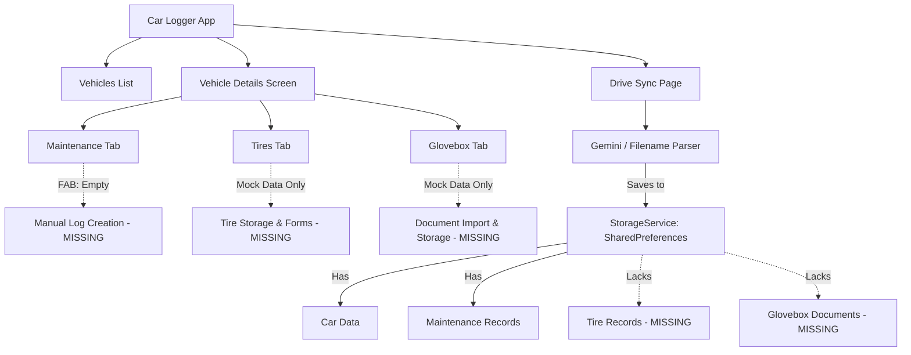

# Car Logger: Feature Specification & Implementation Plan

This document identifies gaps in the current **Car Logger** codebase and outlines a technical design to transition it from a partially-mocked prototype into a fully functional, production-ready application.

---

## 1. Executive Summary & Gaps Analysis

A code audit of the current repository reveals that while the **Google Drive Sync** and **Gemini AI Receipt Parsing** are highly sophisticated, the local UI features and persistent storage layer are largely incomplete or mocked.



### Key Gaps Identified:
1. **Empty FAB Actions:** The Floating Action Button (FAB) on the `CarDetailsPage` does not trigger any action for any of the tabs (Maintenance, Tires, Glovebox).
2. **Mock Tire Data:** The `TiresTab` displays a static, hardcoded Michelin Defender set. There is no local storage or input forms for tire logs.
3. **Mock Glovebox Documents:** The `GloveboxTab` displays mock filenames with mock URLs. There is no ability to select, save, or view registration, insurance, or manual documents.
4. **Hardcoded Maintenance Scheduling:** The "Next Scheduled Maintenance" card in the `MaintenanceTab` is hardcoded to output `Oil Change at [Latest Odometer + 5000] miles`.
5. **No Local Receipt Viewers:** Synced receipts are linked via URLs or Google Drive IDs, but there is no mechanism to view/render them inside the app.

---

## 2. Feature Specifications

### Feature 1: Manual Maintenance Logging
**Goal:** Enable users to log maintenance events manually when they don't have a Google Drive receipt to sync.

*   **UI Flow:** 
    *   User taps the `+` FAB on the **Maintenance Tab**.
    *   A bottom sheet or dialog slides up, containing:
        *   **Title** (Text field with suggestions: Oil Change, Brake Service, etc.)
        *   **Date** (Date picker, default to today)
        *   **Odometer** (Numeric text field, prepopulated with vehicle's last known odometer)
        *   **Cost** (Decimal text field)
        *   **Description** (Multi-line text field)
        *   **Attachment** (Optional: local file/photo picker)
    *   Saving adds the record locally and updates the vehicle's current odometer if the entered odometer is higher.

---

### Feature 2: Tires Lifecycle Management
**Goal:** Replace the mock tire UI with a persistent log of tire sets, tire rotations, and estimated tread life wear.

*   **Data Structure:** Extend the existing `Tire` model or maintain a history of tire events.
*   **UI Flow:**
    *   **Main View:** Shows details of the "Current Tire Set" (Manufacturer, Model, Install Date, Odometer Installed, Estimated Tread Life, and last rotation date/odometer) along with a circular progress gauge estimating remaining tread life.
    *   **Actions:**
        *   *New Tire Set:* Installs a new set, archiving the current one.
        *   *Log Rotation:* Updates `lastRotationDate` and `lastRotationOdometer` on the active set.
    *   **Calculations:**
        $$\text{Remaining Miles} = (\text{Odometer Installed} + \text{Estimated Tread Life}) - \text{Current Vehicle Odometer}$$
        $$\text{Tread Wear \%} = \max\left(0\%, \min\left(100\%, \frac{\text{Remaining Miles}}{\text{Estimated Tread Life}} \times 100\right)\right)$$

---

### Feature 3: Glovebox Document Storage
**Goal:** Allow users to store copies of their Vehicle Registration, Insurance Card, and Owner's Manual locally.

*   **UI Flow:**
    *   Tapping on "Registration" or "Insurance" when empty displays an "Upload Document" prompt.
    *   Using a file picker, the user selects a PDF or image.
    *   The file is saved locally to the application's document directory.
    *   Tapping an uploaded document opens a native viewer (using system-default handlers).
*   **Drive Integration:** Optionally back up these documents to a `/Glovebox/` folder in the user's selected Google Drive sync directory.

---

### Feature 4: Dynamic Maintenance Scheduler
**Goal:** Replace the hardcoded `Oil Change + 5000 mi` card with an expandable scheduler that tracks multiple maintenance categories.

*   **Maintenance Items Configured:**
    1.  **Oil & Filter Change:** Every 5,000 miles / 6 Months
    2.  **Tire Rotation:** Every 7,500 miles / 6 Months
    3.  **Engine Air Filter:** Every 15,000 miles / 12 Months
    4.  **Cabin Air Filter:** Every 15,000 miles / 12 Months
    5.  **Brake Fluid Flush:** Every 30,000 miles / 24 Months
    6.  **Spark Plugs:** Every 60,000 miles
*   **Calculation Logic:**
    *   The app scans the vehicle's maintenance history for records matching keywords (e.g., "oil" for Oil Change, "rotate" or "rotation" for Tire Rotation).
    *   It determines the latest mileage and date completed.
    *   It computes the difference against the current odometer and current date.
    *   It lists tasks grouped by status: **Overdue** (Red badge), **Due Soon** (Yellow badge), and **OK** (Green checkmark).

---

## 3. Technical Implementation Design

### 3.1 Data Models & Storage Service

#### [MODIFY] `lib/models/glovebox.dart`
Store actual local paths or file URIs instead of mock links.
```dart
class Glovebox {
  final String carId;
  final String? registrationPath; // Local path to PDF/image
  final String? insurancePath;
  final String? manualPath;

  Glovebox({
    required this.carId,
    this.registrationPath,
    this.insurancePath,
    this.manualPath,
  });
  // ... toMap() and fromMap()
}
```

#### [NEW] `StorageService` Updates (`lib/services/storage_service.dart`)
Add support for Tires and Glovebox documents.
```dart
  static const String _keyTiresPrefix = 'car_logger_tires_';
  static const String _keyGloveboxPrefix = 'car_logger_glovebox_';

  // Tire Set
  static List<Tire> getTires(String carId) {
    final data = _prefs?.getString('$_keyTiresPrefix$carId');
    if (data == null) return [];
    final List decoded = jsonDecode(data);
    return decoded.map((item) => Tire.fromMap(item)).toList();
  }

  static Future<void> saveTires(String carId, List<Tire> tires) async {
    final data = jsonEncode(tires.map((t) => t.toMap()).toList());
    await _prefs?.setString('$_keyTiresPrefix$carId', data);
  }

  static Future<void> addTire(String carId, Tire tire) async {
    final tires = getTires(carId);
    tires.add(tire);
    await saveTires(carId, tires);
  }

  // Glovebox Documents
  static Glovebox getGlovebox(String carId) {
    final data = _prefs?.getString('$_keyGloveboxPrefix$carId');
    if (data == null) return Glovebox(carId: carId);
    return Glovebox.fromMap(jsonDecode(data));
  }

  static Future<void> saveGlovebox(Glovebox glovebox) async {
    await _prefs?.setString('$_keyGloveboxPrefix${glovebox.carId}', jsonEncode(glovebox.toMap()));
  }
```

---

### 3.2 UI Modals & Forms

#### [NEW] Manual Record Modal (`lib/widgets/add_maintenance_modal.dart`)
A Form matching the layout/animations of `AddCarModal` for logging service history.
*   Uses `TextFormField` validation.
*   Integrates with `storage_service` to call `StorageService.addMaintenanceRecord`.
*   Triggers updating the vehicle's odometer if the new service odometer is higher.

#### [NEW] Tire Form Modal (`lib/widgets/add_tire_modal.dart`)
*   Prompts for: Brand, Model, Date Installed, Mileage Installed, and Estimated Life.
*   Validates numeric values.
*   Calls `StorageService.addTire`.

---

### 3.3 Document Pickers & Files Management

To implement Glovebox uploads and local receipt storage, we should add three common Flutter utility packages:
1.  `file_picker` (for picking PDFs and receipts from the OS).
2.  `image_picker` (if users want to snap a photo of their registration/insurance card directly).
3.  `open_file` or `url_launcher` (to open and display the PDF/image documents natively using the OS handler).

#### Document Save Workflow:
```
[File/Image Picker] 
     │
     ▼
[Selected File Path (Temporary Cache)]
     │
     ▼
[Copy to Application Documents Directory]
  Path: /app_documents/glovebox_<carId>_<type>.<ext>
     │
     ▼
[Save Local Path to SharedPreferences via StorageService]
     │
     ▼
[UI Updates to show 'View Document' option]
```

---

## 4. Verification Plan

### Automated Testing Strategy
1.  **Unit Tests (`test/storage_service_test.dart`):**
    *   Verify saving and loading `Tire` log sets.
    *   Verify saving and loading `Glovebox` document file paths.
2.  **Unit Tests (`test/scheduler_test.dart`):**
    *   Verify the scheduling algorithm computes remaining mileage/months correctly for all 6 maintenance categories.
    *   Verify sorting of due items (Overdue first).

### Manual Verification
1.  **Manually Adding a Record:** Add a manual record at 50,000 miles; verify the vehicle overview updates its odometer, and the Scheduler recalibrates.
2.  **Tire Progress Gauge:** Install a set of tires with 40,000 miles tread life at 10,000 miles. Adjust car odometer to 30,000 miles. Verify the progress gauge reads exactly $50\%$ remaining.
3.  **Glovebox Upload:** Pick a dummy PDF for insurance, verify the status changes to "Uploaded", tap it, and verify the OS opens the file viewer.
